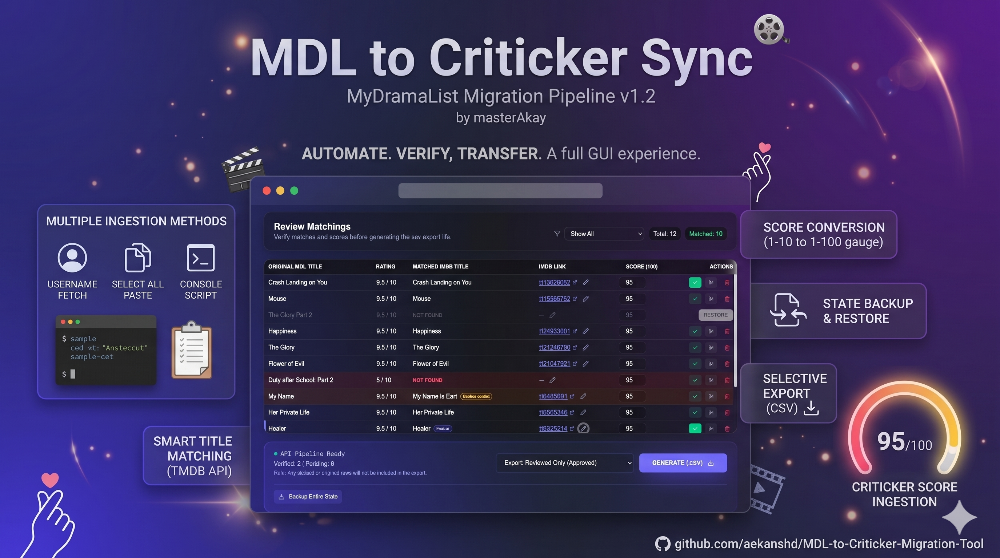
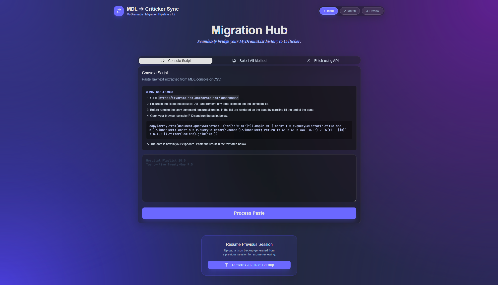

<h1 align="center">MDL to Criticker Sync</h1>

<p align="center">
<a href="https://www.aekansh.in/">
  
</a>

</p>

A migration tool designed to help users seamlessly transfer their watched drama and movie lists from MyDramaList (MDL) to Criticker. The tool fetches your ratings, matches them against the TMDB/IMDb database, and generates a formatted CSV file ready for import into Criticker.

## 🚀 Features

- **Multiple Ingestion Methods**: Support for Username fetching, Select All paste, and Console Script.
- **Smart Title Matching**: Automatically looks up MyDramaList titles using TMDB API to find the corresponding IMDb IDs required by Criticker.
- **Score Conversion**: Automatically converts MDL's 1-10 scoring system to Criticker's 1-100 system.
- **Review Matchings Dashboard**: A comprehensive review dashboard to manually review matches, filter by status (Not Found, Needs Review, Manual Overrides, etc.), and correct/override mismatches.
- **State Backup & Restore**: Backup your entire matched state as a JSON file to resume the review process later.
- **Selective Export**: Export either all matched items or strictly the manually reviewed ones.

## 📖 How to Use

### 1. Extract Data from MyDramaList (Ingestion)

The app offers three methods to import your lists:

- **Console Script (Recommended & Most Reliable):**
  Due to Cloudflare protection, direct scraping often fails. This is the easiest and most reliable method to fetch your entire list.
  1. Go to `https://mydramalist.com/dramalist/<username>`
  2. Ensure in the filters the status is "All", and remove any other filters to get the complete list.
  3. Before running the copy command, ensure all entries in the list are rendered on the page by scrolling till the end of the page.
  4. Open your browser console (F12) and run the provided script (available on the app's first step under the "Console Script" tab).
  5. The data is copied to your clipboard. Paste the result into the text area.
- **Select All Method:**
  1. Go to `https://mydramalist.com/dramalist/<username>`
  2. Ensure in the filters the status is "All", and remove any other filters to get the complete list.
  3. Before selecting, ensure all entries in the list are rendered by scrolling to the end of the page.
  4. Press `Ctrl+A` (or `Cmd+A`) to select all text on the webpage, then copy (`Ctrl+C` / `Cmd+C`).
  5. Paste the copied text into the "Select All Method" text area.
- **Fetch using API:** Enter your MyDramaList username to attempt to fetch your ratings via a proxy. May be blocked by Cloudflare.

### 2. Review Matchings

After processing and fetching IMDb equivalents, use the Dashboard to review the results before exporting.

**Row Color Indicators:**
To help you quickly identify the state of each match, the dashboard rows are color-coded:
- **Red Row:** No match was found for the title. You must manually supply an IMDb link.
- **Yellow Row:** Potential title mismatch (Needs Review). Indicates the TMDB/IMDb match might not perfectly align with the original MDL title.
- **Grayscale / Dimmed Row:** The item is currently marked as "Skipped".
- **Blue Left Border & Badge:** The item has a Manual Override applied.
- **Dark Row (Default):** Ready or pending without major issues.

**Features Available:**
- **Filters:** Use the dropdown to filter items by their status (Unreviewed Only, Not Found, Needs Review, Manual Overrides, etc.).
- **Check/Uncheck:** Marks an entry as "Reviewed" (approved) or "Pending" to signify that you've verified the match.
- **Edit:** If an IMDb ID is incorrect or missing, supply the correct full IMDb URL (e.g. `https://www.imdb.com/title/tt1234567/`) to manually override it.
- **Skip / Unskip:** Marks items to be temporarily ignored. Skipped items are hidden from most filters and are not exported. Use unskip to bring them back.
- **Delete:** Completely removes the entry from the dashboard list.

### 3. Backup and Restore

If you have a large list and want to take a break, you can save your progress and resume later without having to re-fetch and re-match the titles.

- **Backup (Step 3 - Review Matchings):** Click the **Backup Entire State** button at the bottom of the review dashboard. This saves a `.json` file preserving all your pending reviews, manual overrides, checkmarks, deleted items, and skipped items.
- **Restore (Step 1 - Ingestion Phase):** You can resume your session directly from the start page. At the bottom of Step 1, click **Restore State from Backup** and select your `.json` file. This skips the TMDB fetching process and takes you straight back to the review dashboard.

### 4. Exporting to CSV

At the bottom of the review page, you can generate your final CSV for Criticker.

- **Export What?**: Choose "Export: Reviewed Only (Approved)" to export strictly the items you've checked, or "Export: All Available (Pending + Approved)" to export anything with a valid IMDb ID (whether checked or pending).
- *(Note: Any deleted or skipped rows will not be included in the generated export.)*

### 5. Import into Criticker

1. Go to the [Criticker Manual Import Page](https://www.criticker.com/import/?source=manual).
2. Select the `criticker_export.csv` file generated in Step 4.
3. Click "Go" and wait for Criticker to process your ratings!

## 📸 Screenshots

### 1. Ingestion Phase



### 2. Matching & Processing


### 3. Review Matchings Dashboard


## 🛠️ Tech Stack

- **Frontend**: React, Vite, Tailwind CSS, shadcn/ui, framer-motion, lucide-react
- **Backend/API**: Express (Node.js), Axios
- **External Apis**: TMDB API

## 🏃‍♂️ Running Locally

1. Clone this repository.
2. Install dependencies:
   ```bash
   npm install
   ```
3. Create a `.env` file based on `.env.example` and add your TMDB API Key. 
   *(You can get a TMDB API Key by registering an account at [The Movie Database (TMDB)](https://www.themoviedb.org/documentation/api))*
   ```env
   TMDB_READ_ACCESS_TOKEN=your_token_here
   ```
4. Start the development server:
   ```bash
   npm run dev
   ```
